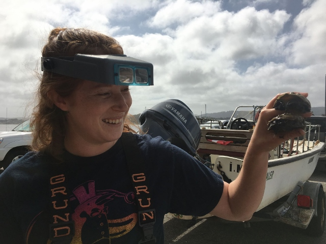

#### Computational Biology: Spring 2017

#### About Me:
[my UVM webpage](https://www.uvm.edu/~biology/?Page=students/ashlockl.php&SM=facultysubmenu.html)  

### R Presentation   
[DESEQ2 Tutorial](R_presentation.html)

### Homeworks:

#####Homework 1

[Assignment 1]()  

#####Homework 2

[Homework 2](Assignment_2.html)

#####Homework 3

[flowchart](flowchart.html)   
[original_pp](originalpp.pdf)   
[beamer_md](Beamer_Presentation.Rmd)   
[beamer_pdf](Beamer_Presentation.pdf)   

#####Homework 4

[creating a .csv file in Excel](homework_4.html)   

[Working with Regular Expressions](RegularExpressions.html)

#####Homework 5
[Basic R commands](homework_5.html)

#####Homework 6
[Functions in R](homework_6.html)

#####Homework 7
[Finishing functions in R](homework_6.html)

#####Homework 8
[Building Functions in R](homework_8.html)

#####Homework 9
[Building Functions in R](homework_9.html)

#####Homework 10
[Building Functions in R](homework_10.html)

